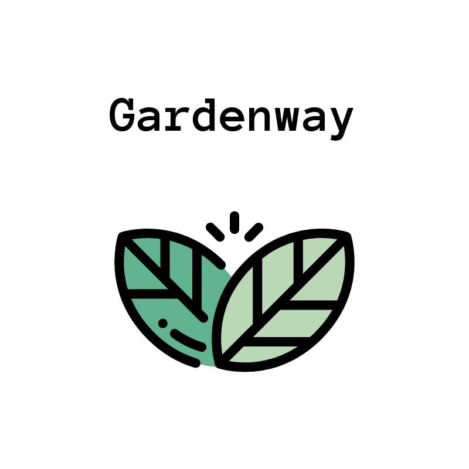

<p align="center">
  
</p>

# Gardenway - Frontend

This is the **frontend** of Gardenway — an e-commerce garden store built using **ReactJS** and deployed via **Netlify**. It consumes data from a Django REST API backend.

[Live Site](https://gardenway.netlify.app/)  
[Backend GitHub Repo](https://github.com/nougat-rey/gardenway)

---

## Project Purpose

Gardenway is a full-stack portfolio project showcasing both backend and frontend development.

To be totally transparent, I had **extensive help from ChatGPT** in the development of the frontend.

---

## Features

✅ Product and order listing with image previews  
✅ Single product detail view  
✅ Account creation and login with JWT authentication  
✅ Add to cart functionality  
✅ Cart page and checkout flow (mocked)  
✅ Live integration with backend API  
✅ Responsive design with CSS  
✅ Deployed to Netlify

---

## Tech Stack

- **ReactJS**
- **React Router**
- **Axios** (API requests)
- **CSS** (custom styles)
- **Netlify** (hosting)

---

## Getting Started

### 1. Clone and install dependencies

```bash
git clone https://github.com/nougat-rey/gardenway_frontend.git
cd gardenway_frontend
npm install
```

### 2. Environment Variables

Create a `.env` file in the root directory with:

```env
REACT_APP_API_URL=https://gardenway-11a7983dd747.herokuapp.com/store
REACT_APP_ASSET_URL=http://localhost:3000
```

> You can use a local backend for development:
> `REACT_APP_API_URL=http://localhost:8000/store`

### 3. Start the development server

```bash
npm start
```

Frontend will be available at:
`http://localhost:3000`

---

## Lessons Learned

- Building this frontend deepened my understanding of **React components**, **state**, **routing**, and **working with APIs**.
- I relied on **ChatGPT** as a coding partner to help debug, design components, and speed up development.
- Combining it with my own backend gave me valuable full-stack experience.

---

## Deployment

This app is deployed with [Netlify](https://www.netlify.com/).

To deploy your own:

1. Fork this repo
2. Set the `REACT_APP_API_URL` variable in Netlify settings
3. Link your repo in Netlify and deploy!

---

## Project Structure

```bash
gardenway_frontend/
├── public/
│   └── images/          # Banner and other static assets
├── src/
│   ├── components/      # Reusable UI components
│   ├── App.js           # Main app + routes
│   └── index.js         # Entry point
├── .env                 # Environment config
└── package.json
```

---

## Contact

Have questions or feedback?
📧 Email me at: **geoffrey.nguyen9@gmail.com**

---

## Acknowledgements

- [ReactJS](https://reactjs.org/)
- [React Router](https://reactrouter.com/)
- [Axios](https://axios-http.com/)
- [Netlify](https://www.netlify.com/)
- Massive thanks to **ChatGPT** for helping bring this to life.
